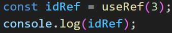

# 멋사 과제

[React (2) - React Hooks](https://www.notion.so/React-2-React-Hooks-1fe7de1fe21480b9a47be1584043037f?pvs=21)

# 1. React의 Hook이란?

### 정의

**Hook**은 함수형 컴포넌트에서 상태(state)나 **라이프사이클 기능** 등을 사용할 수 있게 해주는 **특별한 함수**입니다. Hook은 클래스 없이도 상태를 관리하거나 side effect를 수행할 수 있도록 도와줍니다.

## 1)  왜 Hook을 사용하는가?

과거에는 상태 관리나 생명주기(lifecycle) 메서드를 사용하려면 **클래스형 컴포넌트**를 써야 했습니다.

하지만 **함수형 컴포넌트 + Hook** 조합을 사용하면 더 간단하고 재사용 가능한 코드가 됩니다:

### 정리하자면 Hook은:

- 함수형 컴포넌트에서도 **상태 관리** 가능
- 클래스 없이도 **라이프사이클 관리** 가능
- **로직을 재사용하기 쉬움** (커스텀 훅)

## 2) 주요 Hook 종류 및 간단한 설명

**useState**: 컴포넌트에 상태(state)를 추가

**useEffect :** 컴포넌트가 렌더링된 이후 실행되는 side effect 처리

**useContext :** 전역 상태나 데이터를 Context API를 통해 공유

**useRef :** DOM 요소에 접근하거나, 리렌더링 없이 값을 기억

**useReducer :** 복잡한 상태 로직을 관리 (Redux와 유사한 구조)

**useMemo :** 연산량이 많은 작업을 메모이제이션 (성능 최적화)

**useCallback :** 함수를 메모이제이션하여 렌더링 시 동일 참조 유지

**useLayoutEffect :** 렌더링 후 레이아웃 계산 등 동기 작업

**useImperativeHandle :** 자식 컴포넌트의 ref 제어 방식 커스터마이징

## 3) Hook 사용 시 주의점

1. **조건문, 반복문, 중첩된 함수 안에서 사용하지 마세요.**
    - 항상 컴포넌트 최상단에서 호출해야 함
    - 이유: Hook의 호출 순서가 바뀌면 상태 관리가 꼬임
2. **Hook은 함수형 컴포넌트에서만 사용 가능** (클래스 컴포넌트에선 사용 불가)

## 4) 우리가 배운 주요 Hook 사용법

### `useState`

- 상태(state)를 저장하고 업데이트 하는 데 사용됨.
- 상태가 변경되면 컴포넌트가 리렌더링 됨.
- 화면에 영향을 주는 값을 저장할 때 사용.

**언제 사용하나?**

- 버튼 클릭 횟수
- 입력값 상태
- 탭 선택 상태 등

```java
const [count, setCount] = useState(0);
```

```java
import { useState } from 'react';

function Counter() {
  const [count, setCount] = useState(0); // 초기값 0

  return (
    <div>
      <p>{count}</p> {/* count가 변경되면 화면도 업데이트됨 */}
      <button onClick={() => setCount(count + 1)}>증가</button>
    </div>
  );
}
```

### 🔹 `useRef`

- 값을 저장하지만, 그 값이 바뀌어도 리렌더링 되지 않음
- 주로 DOM 요소에 접근하거나, 렌더링과 관계없는 변수를 저장할 때 사용
- .current 프로퍼티를 통해 값을 저장하거나 접근

## **useRef?**

: 새로운 Reference 객체를 생성하는 기능

```jsx
const refObject = useRef();
// refObject를 컴포넌트 내부의 변수로 활용 가능
```

### **useRef와 useState의 차이점**

**useRef**

- Reference 객체 생성
- 컴포넌트 내부의 변수로 활용 가능
- 어떤 경우에도 리렌더링 X

**useState**

- State 생성
- 컴포넌트 내부의 변수로 활용 가능
- 값 변경되면 컴포넌트 리렌더링

### useRef는 어떻게 생겼을까?




useRef를 콘솔에 찍어보면 current라는 프로퍼티에 설정한 초기값을 담고 있음.

그래서 useRef의 값을 사용하고 싶으면


`.current`를 이용하면 됨.

**언제 사용하나?**

- input 포커스 주기
- setTimeout ID 저장
- 이전 값을 저장해 비교

# 과제

<aside>
💻

- React에서 사용하는 hook이 무엇인지,
hook의 종류에는 어떤 것들이 있는지,
우리가 여태 배운 hook은 어떻게 쓰는지
각자 노션에 정리
- Delete 기능 구현 마무리(Update 기능 구현과 똑같음)
- hook의 한 종류인 useReducer 사용하여 Todo List 코드 재구성
</aside>